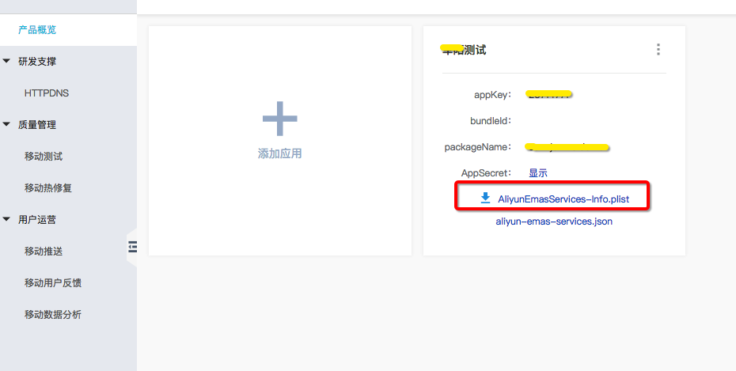

# React-Native-Emas

## 安装依赖

  ① ` npm i @terminus/react-native-emas -save `

### Android

  ② 在 android/settings.gradle:中添加

    ```
    include ':react-native-emas'
    project(':react-native-emas').projectDir = new File(rootProject.projectDir, '../node_modules/@terminus/react-native-emas/android')
    ``` 
  ③ 在 android/app/build.gradle 中的 dependencies 模块中添加
    `implementation project(':react-native-emas')`
    
  ④ android/build.gradle中添加Maven仓库地址：
    ```
    allprojects {
      repositories {
        maven {
          url 'http://maven.aliyun.com/nexus/content/repositories/releases/'
        }
      }
    }
    ```

  ⑤ 在项目的AndroidManifest.xml中添加
    ```
    <uses-permission android:name="android.permission.INTERNET" />
    <uses-permission android:name="android.permission.ACCESS_NETWORK_STATE"/>
    <uses-permission android:name="android.permission.READ_PHONE_STATE"/>
    <uses-permission android:name="android.permission.ACCESS_WIFI_STATE"/>
    <uses-permission android:name="android.permission.WRITE_EXTERNAL_STORAGE"/>
    <uses-permission android:name="android.permission.READ_SETTINGS"/>
    <uses-permission android:name="android.permission.READ_EXTERNAL_STORAGE"/>
    ···
    <application>
      <meta-data android:name="ALIYUN_MAN_CHANNEL" android:value="你的渠道" ></meta-data>
      <meta-data android:name="EMAS_APPKEY" android:value="\你的AppKey（\符号不能省略）"></meta-data>
      <meta-data android:name="EMAS_APPSECRET" android:value="你的APPsecret"></meta-data>
    </application>
    ```

  ⑥ 打开 android/app/src/main/java/[...]/MainApplication.java，添加`import com.terminus.emas.RNEmasPackage;`
    在 getPackages() 方法添加`new RNEmasPackage()`

  ⑦ 初始化 
  * 在android/app/src/main/java/[...]/MainApplication.java中添加`import com.terminus.emas.RNEmasManager;`
    onCreate方法中添加
    ```
    RNEmasManager.getInstance().turnOffAutoTrack();     //通过此接口关闭页面自动打点功能,不调用默认开启
    RNEmasManager.getInstance().turnOnDebug();          //打开调试日志，线上版本建议关闭,不调用默认关闭
    RNEmasManager.getInstance().init(this);             //初始化
    ```

  * 在android/app/src/main/java/[...]/MainActivity.java中添加`import com.terminus.emas.RNEmasManager;`

    onResume方法中添加
    ```
    @Override
    protected void onResume() {
        super.onResume();
        RNEmasManager.getInstance().onResume(this);
    }
    ```

    onPause方法中添加
    ```
    @Override
    protected void onPause() {
        super.onPause();
        RNEmasManager.getInstance().onPause(this);
    }
    ```

### IOS
  ② 在Pods下的Podfile中添加
    ```
    source 'https://github.com/aliyun/aliyun-specs.git'

    pod 'react-native-emas', :path => '../node_modules/@terminus/react-native-emas/react-native-emas.podspec'
    ```

  ③在控制台产品概览页面，下载App的配置文件AliyunEmasServices-Info.plist，如下图所示：
  
  Xcode中，把下载的AliyunEmasServices-Info.plist文件拖入对应App Target下即可，在弹出框勾选Copy items if needed。

  ④ 初始化
    在AppDelegate.m 中初始化
    ```
        #import "RNEmasManager.h"
        #import <AlicloudMobileAnalitics/ALBBMAN.h>

        - (BOOL)application:(UIApplication *)application didFinishLaunchingWithOptions:(NSDictionary *)launchOptions
        {
          ALBBMANAnalytics *man = [ALBBMANAnalytics getInstance];
          [man turnOnDebug];  //打开调试日志，线上版本建议关闭
          [man setChannel:@"你的渠道"];   //设置渠道（用以标记该app的分发渠道名称），如果不关心可以不设置即不调用该接口，渠道设置将影响控制台【渠道分析】栏目的报表展现。
          [man autoInit];
        }
    ```

## 使用

  `import { onSignUp, onLogin, onLogout, onPageInfo, onEvent } from '@terminus/react-native-emas'`

## 以下方法均以promise返回结果
### onSignUp
    用户注册时调用,传入参数为用户名

### onLogin
    用户登录时调用,传入参数为用户名和用户ID

### onLogout
    用户注销时调用,无需传参

### onPageStart
    进入页面时调用,传入参数为当前页面名称（String类型）

## onPageEnd
    离开页面时调用,与onPageStart配对使用,调用该方法将自动上传页面名称和页面停留时间
    传入参数为: pageName(必要):当前页面名称,页面名称与onPageStart传入的页面名称对应，String类型
              referPageName:来源页面,不传参数则自动获取前置页面,String类型
              properties:其余需传入的自定义属性,map<String,String>类型

### onPageInfo
    手动页面埋点,传入参数为: pageName(必要):页面名称,String类型
                          referPageName:关联的页面名称,String类型
                          duration:页面停留时间,number类型
                          properties:其余自定义属性,Map<String,String>类型
                          globalProperty:IOS专用,设置全局字段,map<String,String>类型
                          removeGlobalProperty:IOS专用,删除全局字段,值为globalProperty中的key,Array<String>类型

### onEvent
    自定义事件,传入参数为: eventLabel(必要):String类型,只能为字母、数字和下划线组成
                        eventPage:关联的页面名称,String类型
                        eventDuration:页面停留时间,number类型
                        properties:其余自定义属性,map<String,String>类型

### 使用范例
    ```
  import { onSignUp, onLogin, onLogout, onPageInfo, onEvent } from '@terminus/react-native-emas'

    <View>
      <Button title={'SignUp'} onPress={()=>onSignUp("singuptest")}/>

      <Button title={'Login'} onPress={()=>onLogin("userNick","12345")}/>

      <Button title={'Logout'} onPress={()=>onLogout()}/>

      <Button title={'PageStart1'} onPress={()=>onPageStart("duration test page1")}/>

      <Button title={'PageEnd1'} onPress={()=>onPageEnd({pageName:"duration test page1",referPageName:"referPage",properties:{key1:"value1",key2:"value2"}})}/>

      <Button title={'PageStart2'} onPress={()=>onPageStart("duration test page2")}/>

      <Button title={'PageEnd2'} onPress={()=>onPageEnd({pageName:"duration test page2",properties:{key1:"value1",key2:"value2"}})}/>

      <Button title={'onPageInfo'} onPress={()=>onPageInfo({pageName:"myTestPage",referPageName:"myReferPageName",duration:200,properties:{gender:"male",height:"182"},globalProperty:{key1:"value1",key2:"value2"},removeGlobalProperty:["key1","key2"]})}/>

      <Button title={'onEvent'} onPress={()=>onEvent({eventLabel:"label",eventPage:"eventPage",eventDuration:300,properties:{type:"rock",language:"cn"}})}/>

    </View>
    ```