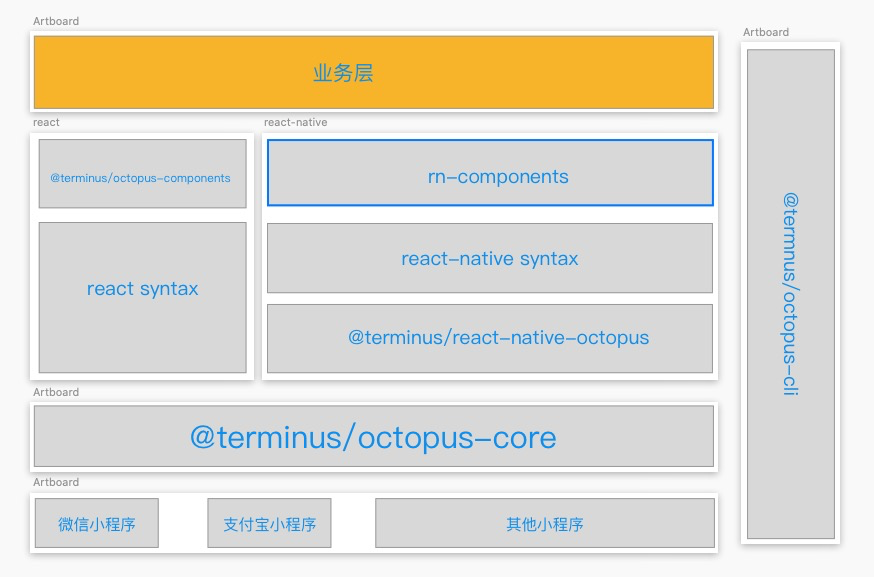

# 小程序端开发编译说明

- [cli](./CLI.md)
- [配置](./CONFIG.md)
- [入口](./APP.md)
= [页面](./PAGE.md)




### 小程序工程
小程序端主要实现的是让react能在小程序环境跑起来。

1. 实现原理

- 修改react render的配置, 修改hostConfig的配置，react vdom与小程序octopus vdom建立联系
- 编译时收集代码中使用的组件(jsx标签), 从中筛选出小程序组件与自定义组件或者第三方组件，通过筛选出来的小程序组件创建对应的小程序模版，并生成一个模版id，运行时建立关联。（小程序无法动态创建模版、标签，所以需要编译期收集组件信息）
- 运行时通过小程序的模版能力，小程序octopus vdom通过模版id查找已存在的模版，驱动模版渲染
- 通过`@terminus/core`模版对小程序生命周期与react生命周期做一定的关联，并对小程序的生命周期提供react hooks 方便调用

###  react native工程

1. 实现原理
类似于react-native变成h5的实现类似, 小程序端编译时会将以下模块替换
```bash
@terminus/react-native => @terminus/react-native-ocotpus
```
`@terminus/react-native-ocotpus`将会提供基于`@terminus/octopus-core`小程序基础组件一层封装、抹平差异后的`@terminus/react-native`组件、api，尽量保证业务开发无需关心小程序端具体实现

2. 注意事项

- 需要提供小程序的入口文件 mp_app.tsx(octopus.config.js可配置)
- 入口文件尽可能的静态，尤其是路由信息
- 入口逻辑可能需要单独写（app,web,小程序各一套）
- 特殊业务特殊代码 小程序一文件后缀名作区分(.mp.tsx, .mp.ts)， 可在octopus.config.js中配置
