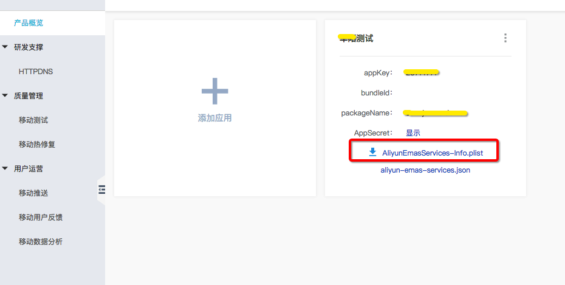

# React-Native-Emas

## 安装依赖

  ① ` npm i @terminus/react-native-emas -save `

### Android

  ② 在 android/settings.gradle:中添加

    ```
    include ':react-native-emas'
    project(':react-native-emas').projectDir = new File(rootProject.projectDir, '../node_modules/@terminus/react-native-emas/android')
    ``` 
  ③ 在 android/app/build.gradle 中的 dependencies 模块中添加
    `implementation project(':react-native-emas')`

  ④ 项目build.gradle中添加Maven仓库地址：
    ```
    allprojects {
        repositories {
            maven {
                url 'http://maven.aliyun.com/nexus/content/repositories/releases/'
            }
        }
    }
    ```

  ⑤ 在项目的AndroidManifest.xml中添加权限
    ```
    <uses-permission android:name="android.permission.INTERNET" />
    <uses-permission android:name="android.permission.SYSTEM_ALERT_WINDOW"/>
    <uses-permission android:name="android.permission.ACCESS_NETWORK_STATE"/>
    <uses-permission android:name="android.permission.READ_PHONE_STATE"/>
    <uses-permission android:name="android.permission.ACCESS_WIFI_STATE"/>
    <uses-permission android:name="android.permission.WRITE_EXTERNAL_STORAGE"/>
    <uses-permission android:name="android.permission.READ_SETTINGS"/>
    <uses-permission android:name="android.permission.READ_EXTERNAL_STORAGE"/>
    ```

  ⑥ 打开 android/app/src/main/java/[...]/MainApplication.java，添加`import com.terminus.emas.RNEmasPackage;`
    在 getPackages() 方法添加`new RNEmasPackage()`
  
  

  ??
      packagingOptions {
        exclude 'lib/x86/libMotu.so'
        exclude 'lib/armeabi-v7a/libMotu.so'
        exclude 'lib/armeabi/libMotu.so'
    }
  

  ⑥ 初始化 
    在android/app/src/main/java/[...]/MainApplication.java中添加`import com.terminus.emas.RNEmasManager;`
    onCreate方法中添加`RNEmasManager.init(this,getApplicationContext(),"你的APPkey","你的APPsecret");`


### IOS
  ② 在Pods下的Podfile中添加
    ```
    source 'https://github.com/CocoaPods/Specs.git'
    source 'https://github.com/aliyun/aliyun-specs.git'

    `pod 'react-native-emas', :path => '../node_modules/@terminus/react-native-emas/react-native-emas.podspec'`
    ```


  ③在控制台产品概览页面，下载App的配置文件AliyunEmasServices-Info.plist，如下图所示：
  
  Xcode中，把下载的AliyunEmasServices-Info.plist文件拖入对应App Target下即可，在弹出框勾选Copy items if needed。

  ④ 初始化
    在AppDelegate.m 中初始化
    ```
        #import "RNEmasManager.h"
        #import <AlicloudMobileAnalitics/ALBBMAN.h>

        - (BOOL)application:(UIApplication *)application didFinishLaunchingWithOptions:(NSDictionary *)launchOptions
        {
            ALBBMANAnalytics *man = [ALBBMANAnalytics getInstance];
            [man autoInit];
        }
    ```


## 使用

  `import { onSignUp, onLogin, onLogout, onPageEnd, onPageStart, onEvent } from '@terminus/react-native-emas'`

### onSignUp
    用户注册时调用，传入参数为用户名

### onLogin
    用户登录时调用，传入参数为用户名和用户id

### onLogout
    用户注销时调用，无需传参

### onPageStart
    进入页面时调用，无需传参

### onPageEnd
    离开页面时调用，无需传参

### onEvent
    自定义事件，传入参数为: eventLabel(必要):string类型，只能为字母、数字和下划线组成
                        eventPage:关联的页面名称，string类型
                        eventDuration:页面停留时间，number类型
                        properties:其余自定义属性，map类型

### 使用范例
    ```
    <View>
          <Button title={'SignUp'} onPress={()=>onSignUp("singuptest")}/>
          <Button title={'Login'} onPress={()=>onLogin("userNick","12345")}/>
          <Button title={'Logout'} onPress={()=>onLogout()}/>
          <Button title={'PageStart'} onPress={()=>onPageStart()}/>
          <Button title={'PageEnd'} onPress={()=>onPageEnd()}/>
          <Button title={'onEvent'} onPress={()=>onEvent({eventLabel:"label",eventPage:"eventPage",eventDuration:300,properties:{type:"rock",language:"cn"}})}/>
    </View>
    ```